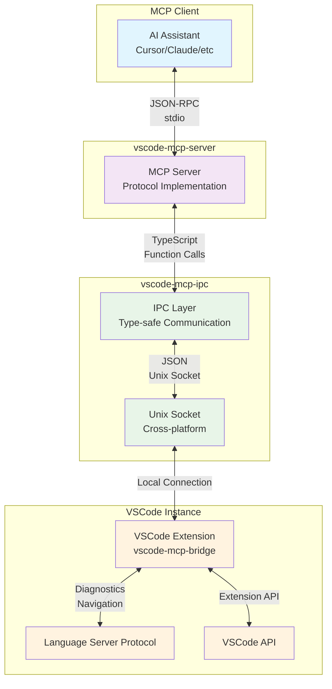

# VSCode MCP

<p align="center">
  
</p>

<p align="center">
  <strong>Connect VSCode with MCP (Model Context Protocol) for enhanced AI assistant capabilities</strong>
</p>

<p align="center">
  <a href="#design-motivation">Design Motivation</a> •
  <a href="#available-tools">Available Tools</a> •
  <a href="#installation">Installation</a> •
  <a href="#architecture">Architecture</a> •
  <a href="#license">License</a>
</p>

## Overview

VSCode MCP is a comprehensive monorepo solution that enables MCP (Model Context Protocol) clients to access rich VSCode context information in real-time. This project bridges the gap between AI assistants and your development environment, providing accurate code analysis, diagnostics, and intelligent code navigation.

## Design Motivation

**VSCode MCP Bridge primarily serves AI IDEs (like Cursor) and AI coding agents**, helping them develop and analyze code more efficiently.

Traditional AI coding agents often need to execute time-consuming commands when validating code modifications:

- `tsc --noEmit` - TypeScript type checking
- `eslint .` - Code style checking
- `npm run build` - Project building

These commands run slowly in large projects, severely impacting AI development efficiency. VSCode MCP Bridge provides real-time LSP (Language Server Protocol) information, allowing AI agents to:

- **Get fast diagnostics** (`get-diagnostics`) - Replace time-consuming type checking and lint commands
- **Access real-time type information** (`get-hover`) - Get accurate type definitions without compilation
- **Navigate code efficiently** (`get-definition`, `get-references`) - Understand code structure and dependencies

### Core Advantages

1. **Real-time**: Leverage VSCode's LSP for real-time code state without executing slow commands
2. **Accuracy**: Precise analysis based on language servers, more reliable than static analysis
3. **Efficiency**: Significantly reduce AI coding agent wait times
4. **Integration**: Deep integration with VSCode ecosystem, supporting multiple languages and extensions

## Available Tools

VSCode MCP provides the following tools through the MCP protocol:

| Tool                   | Description                                      | Parameters                                                                                    |
| ---------------------- | ------------------------------------------------ | --------------------------------------------------------------------------------------------- |
| **execute_command**    | Execute VSCode commands with arguments           | `command`, `args?`                                                                            |
| **get_commands**       | Get all available VSCode commands in workspace   | `include_internal?`, `filter?`, `category?`, `limit?`                                         |
| **get_definition**     | Get symbol definition locations                  | `uri`, `line`, `character`                                                                    |
| **get_diagnostics**    | Get diagnostic information with Git integration  | `uris` (array, empty = all git modified files)                                                |
| **get_hovers**         | Get hover information for multiple positions     | `positions` (array), `includeAllHovers?`                                                      |
| **get_references**     | Get symbol reference locations                   | `uri`, `line`, `character`, `includeDeclaration?`                                             |
| **get_signature_help** | Get function signature help                      | `uri`, `line`, `character`                                                                    |
| **health_check**       | Test connection and get extension status         | None                                                                                          |
| **highlight_code**     | Open file and highlight specific code sections   | `uri`, `ranges` (array with line numbers, messages, types, colors), `showEditor?`, `timeout?` |
| **open_diff**          | Open diff editor to compare files or text        | `before?`, `after?`, `beforeText?`, `afterText?`, `beforeLabel?`, `afterLabel?`, `language?`  |
| **open_files**         | Open multiple files with optional editor display | `files` (array with `uri` and `showEditor?`)                                                  |
| **rename_symbol**      | Rename symbols across all files in workspace     | `uri`, `line`, `character`, `newName`                                                         |
| **request_input**      | Request simple text input from user              | `prompt`, `placeholder?`, `title?`, `password?`, `validateInput?`                             |

> **⚠️ Security Warning**: The `execute_command` tool can execute arbitrary VSCode commands and potentially trigger dangerous operations. Use with extreme caution and only with trusted AI models.

All tools require the `workspace_path` parameter to target specific VSCode instances.

## Installation

> **🚨 IMPORTANT**: Before installing the MCP server, you must first install the VSCode MCP Bridge extension in your VSCode instance. The extension is required for the MCP server to communicate with VSCode.

### Step 1: Install VSCode Extension

Install the VSCode MCP Bridge extension using ID: `YuTengjing.vscode-mcp-bridge`

[](https://marketplace.visualstudio.com/items?itemName=YuTengjing.vscode-mcp-bridge)

Or search for "VSCode MCP Bridge" in the VSCode Extensions marketplace.

### Step 2: Install MCP Server

#### Install in Cursor ✅ Tested

##### Click the button to install

[](https://cursor.com/install-mcp?name=vscode-mcp&config=eyJjb21tYW5kIjoibnB4IEB2c2NvZGUtbWNwL3ZzY29kZS1tY3Atc2VydmVyQGxhdGVzdCJ9)

##### Or install manually

Go to `Cursor Settings` -> `Tools & Integrations` -> `New MCP Server`. Name to your liking, use `command` type with the command `npx @vscode-mcp/vscode-mcp-server@latest`. You can also verify config or add command line arguments via clicking `Edit`.

```json
{
  "mcpServers": {
    "vscode-mcp": {
      "command": "npx",
      "args": ["@vscode-mcp/vscode-mcp-server@latest"]
    }
  }
}
```

<details>
<summary><strong>Install in VS Code</strong></summary>

[Install in VS Code](https://insiders.vscode.dev/redirect?url=vscode%3Amcp%2Finstall%3F%257B%2522name%2522%253A%2522vscode-mcp%2522%252C%2522command%2522%253A%2522npx%2522%252C%2522args%2522%253A%255B%2522%2540vscode-mcp%252Fvscode-mcp-server%2540latest%2522%255D%257D)

[Install in VS Code Insiders](https://insiders.vscode.dev/redirect?url=vscode-insiders%3Amcp%2Finstall%3F%257B%2522name%2522%253A%2522vscode-mcp%2522%252C%2522command%2522%253A%2522npx%2522%252C%2522args%2522%253A%255B%2522%2540vscode-mcp%252Fvscode-mcp-server%2540latest%2522%255D%257D)

You can also install the VSCode MCP server using the VS Code CLI:

```bash
# For VS Code
code --add-mcp '{"name":"vscode-mcp","command":"npx","args":["@vscode-mcp/vscode-mcp-server@latest"]}'
```

After installation, the VSCode MCP server will be available for use with your GitHub Copilot agent in VS Code.

</details>

<details>
<summary><strong>Install in Windsurf</strong></summary>

Follow Windsurf MCP [documentation](https://docs.windsurf.com/windsurf/cascade/mcp). Use following configuration:

```json
{
  "mcpServers": {
    "vscode-mcp": {
      "command": "npx",
      "args": ["@vscode-mcp/vscode-mcp-server@latest"]
    }
  }
}
```

</details>

## Architecture

VSCode MCP follows a modular architecture with three main components communicating through Unix sockets:



### Communication Flow

1. **MCP Client** sends requests via JSON-RPC over stdio
2. **MCP Server** translates requests to TypeScript function calls
3. **IPC Layer** handles type-safe communication and validation
4. **Unix Socket** provides fast, local-only communication
5. **VSCode Extension** executes operations using VSCode APIs
6. **LSP Integration** provides real-time code analysis and navigation

### Multi-Workspace Support

Each VSCode workspace gets its own socket connection:

- `/Users/user/frontend` → `/tmp/vscode-mcp-a1b2c3d4.sock`
- `/Users/user/backend` → `/tmp/vscode-mcp-e5f6g7h8.sock`

### How It Works

Once installed and configured, VSCode MCP works seamlessly with MCP-compatible clients:

1. **VSCode Extension**: Runs in your VSCode instance and provides access to LSP data
2. **MCP Server**: Translates MCP protocol calls to VSCode extension requests
3. **Socket Communication**: Uses Unix sockets for fast, local-only communication
4. **AI Integration**: MCP clients can access real-time code context through standard tools

The system operates transparently - MCP clients use standard tool calls, and VSCode MCP handles all the complexity of communicating with VSCode's APIs.

All tools require the `workspace_path` parameter to target specific VSCode instances. Each VSCode workspace gets its own socket connection for multi-window support.

## License

This project is licensed under the [Anti 996](https://github.com/996icu/996.ICU/blob/master/LICENSE) License.
